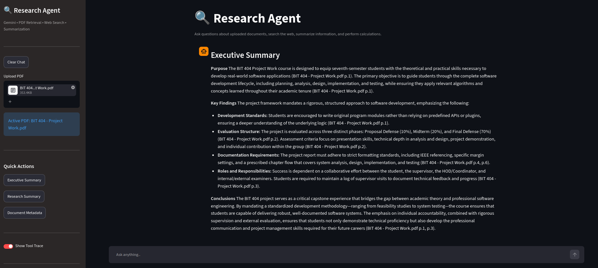
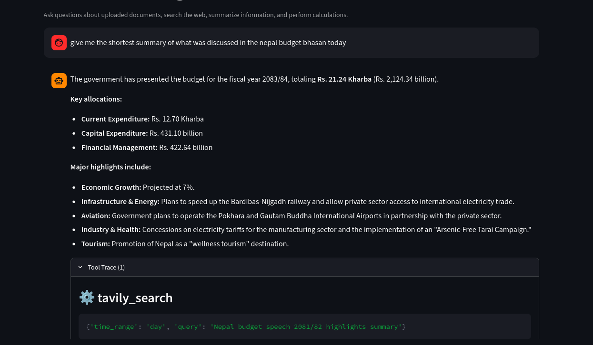
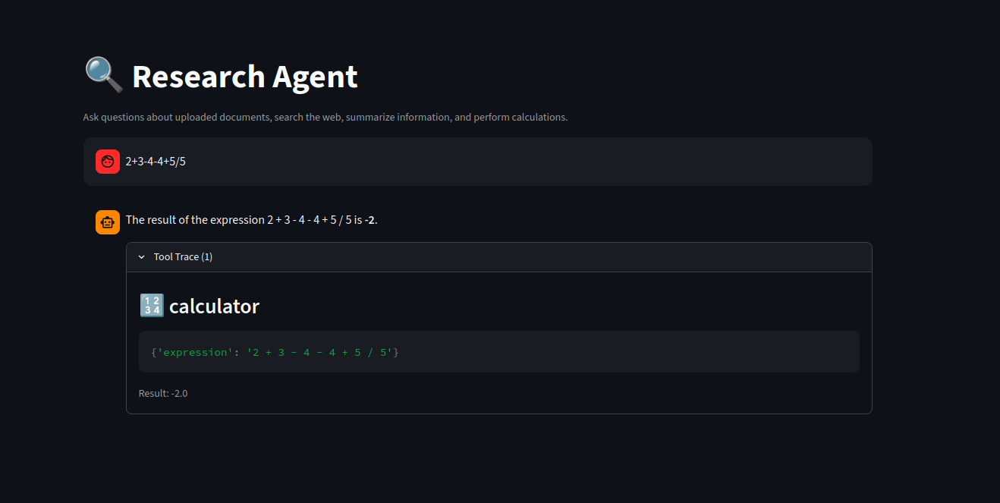

<div align="center">

#  Research Agent ✨

### Gemini-Powered • PDF RAG • Web Search • Calculator

A modern AI research agent that can chat, search the web, analyze PDFs, summarize documents, and perform calculations from a Streamlit interface.

<p align="center">
  
  
  
  
</p>

> **Wanna try it out? [Here you go!](https://questor-researchagent.streamlit.app/)**

---

</div>

## Features

###  Intelligent PDF Research
- Upload PDF documents instantly
- Automatic document processing
- Semantic search using embeddings
- Hybrid Retrieval (Dense + BM25)
- Context-aware answers with citations

###  AI-Powered Summaries
- Executive Summaries
- Research Summaries
- Detailed Summaries
- Bullet-Point Summaries

### Web Research
- Real-time web search via Tavily
- Current events & facts
- External knowledge retrieval
- Research augmentation

### Built-in Calculator
- Mathematical expressions
- Percentages
- Scientific functions
- Fast evaluations

## Preview
### PDF Search and Summary
Ask anything about your pdf and generate intelligent summaries with a click! (RAG)

---


### Web Search
Search everything you want!

---



### Calculator
From basic to high level math in a go!

---



###  Advanced Retrieval Pipeline

```text
User Query
    │
    ▼
Query Understanding
    │
    ▼
Hybrid Retrieval
(BM25 + Chroma)
    │
    ▼
Gemini Re-ranking
    │
    ▼
Context Assembly
    │
    ▼
Final Answer
```

---

## Tech Stack

| Component | Technology |
|-----------|------------|
| LLM | Google Gemini |
| Agent Framework | LangChain |
| UI | Streamlit |
| Vector Database | ChromaDB |
| Retrieval | BM25 + Dense Retrieval |
| OCR/Document Search | PDF RAG |
| Search Engine | Tavily |
| Embeddings | Gemini Embeddings |

---

## Getting Started

### Clone Repository

```bash
git clone https://github.com/Raksha-Karn/Questor-ResearchAgent.git
cd questor
```

### Create Virtual Environment

```bash
python -m venv .venv
```

Activate:

```bash
# Windows
.venv\Scripts\activate

# Linux / Mac
source .venv/bin/activate
```

### Install Dependencies

```bash
pip install -r requirements.txt
```

### Configure Environment

Create a `.env` file:

```env
GEMINI_API_KEY=your_api_key
TAVILY_API_KEY=your_api_key
```

### Launch

```bash
streamlit run app.py
```

> **Enjoy!**
---